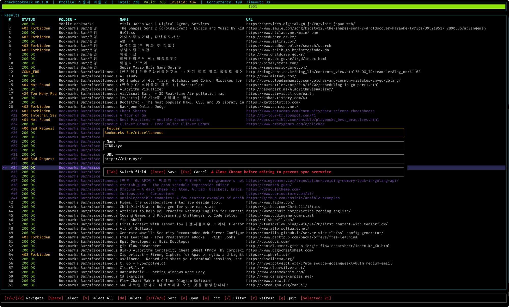

# checkbookmark

Chrome 북마크 URL 유효성 검사 TUI 도구.

Chrome 북마크 파일을 읽어 각 URL에 HTTP HEAD 요청을 동시에 보내고,
살아있는 북마크와 죽은 북마크를 리포트하고 편집한다.



## 설치

```bash
cargo install --path .
```

## 사용법

```bash
# TUI 프로필 선택 후 검사
checkbookmark

# 북마크 파일 직접 지정
checkbookmark -f /path/to/Bookmarks

# 동시 요청 수, 타임아웃 설정
checkbookmark -c 20 -t 5
```

## 옵션

| 옵션 | 축약 | 기본값 | 설명 |
|---|---|---|---|
| `--file <FILE>` | `-f` | 자동 탐색 | 북마크 파일 경로 |
| `--concurrency <N>` | `-c` | 100 | 동시 요청 수 |
| `--timeout <SECS>` | `-t` | 3 | 요청 타임아웃(초) |

## 주의사항

Chrome이 실행 중이거나 재시작하면 북마크 파일을
직접 수정하더라도 sync에 의해 자동으로 원복된다.
`:w` 저장 후 생성되는 HTML 내보내기 파일을
Chrome의 `chrome://bookmarks` > ⋮ > **북마크 가져오기**로
import 해야 변경 사항이 반영된다.
